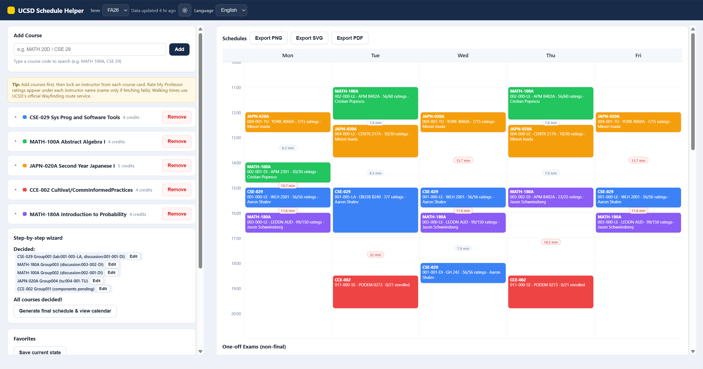

# UCSD 排课助手（UCSD Schedule Helper）

[English](README.md) | **中文**

一个本地优先的 UCSD 选课排课工具：从 UCSD Class Planner 拉取真实分班数据，通过向导逐步确定正课/讨论，枚举所有不冲突的课表组合，还可以让 DeepSeek 帮你参谋。全程在你的浏览器里运行，无需注册账号。



## 功能

- **真实 UCSD 数据** — 分班、时间、教室、老师、剩余座位，来源为 UCSD Class Planner / TSS
- **逐门向导** — 先定正课，再选讨论/实验；日历实时预览，冲突时给出替代方案
- **全部方案模式** — 枚举所有不冲突的组合，支持对比、保存和导出
- **Rate My Professor** — 老师名下直接显示评分（尽力抓取，失败时只显示名字）
- **步行时间估算** — 使用 UCSD 官方 Wayfinding 路线，失败时自动降级
- **期末考试** — 单独的按日期日历展示
- **动态时间轴** — 课表从第一节课前一小时左右开始，不再从 7:00 白白留白
- **DeepSeek 问答** — 自动附带当前课表和完整分班信息
- **白天/黑夜主题** 与 **中文/English**，都会记住你的选择
- **导出** — PNG / SVG / PDF，打印排版友好
- **数据全部本地** — 无遥测、无账号

## 快速开始

要求：**Python 3.8+** 和任意现代浏览器。

**Windows：** 双击 `start.bat`（固定使用 8778 端口，带防重复启动）。

**手动 / macOS / Linux：**

```bash
python scheduler.py --port 8778
# 或者 python3 scheduler.py --port 8778
```

然后打开 <http://127.0.0.1:8778/>。

> 首次运行较慢（通常一分钟内）：程序会生成本地缓存（楼宇坐标、步行路线、老师评分）。之后每次运行都很快。

## 使用方法

1. **添加课程** — 输入类似 `MATH 100A` 的代码，点"添加"。
2. **逐门向导**（默认模式）— 一门一门定：正课 → 讨论/实验。日历预览会实时显示你选的分班和剩余座位。
3. **全部方案模式** — 生成所有不冲突的组合，逐个浏览，最多对比 3 个，也可以固定某些分班。
4. **导出** — PNG / SVG / PDF，包含课表标题、周课表和期末考试。
5. **DeepSeek**（可选）— 问"这个课表会不会太累？"，程序会自动带上时间、教室、老师、RMP、座位和期末考试信息。

课程、向导进度、收藏和对话记录会自动保存到同目录的 `saved_data.json`。删除该文件即可重置。

## DeepSeek AI（可选，别问为什么是deepseek因为梁圣nb）

- 在 [platform.deepseek.com](https://platform.deepseek.com) 获取你自己的 API Key
- Key 只保存在浏览器 `localStorage`，不会写入磁盘，也不会发给除 DeepSeek API 以外的任何地方
- 不填 Key，排课功能完全不受影响

## 隐私

- 纯本地运行：服务器只监听 `127.0.0.1`，不暴露到公网
- 无账号、无统计、无遥测
- `buildings_cache.json`、`routes_cache.json`、`rmp_cache.json` 是可再生的缓存，删掉也没关系

## 项目结构

```
scheduler.py   Python 标准库 HTTP 服务器 + UCSD Class Planner 代理
index.html     单页界面（原生 HTML/CSS/JS，无构建步骤）
start.bat      Windows 启动器（端口 8778）
README.md      英文说明
README.zh-CN.md 中文说明（本文件）
使用说明.md     中文使用指南
```

## 技术栈

- 仅用 Python 标准库（无需 pip 安装任何依赖）
- 原生 HTML/CSS/JS（无框架、无打包器）
- 部署只需两个文件：`scheduler.py` + `index.html`

## 常见问题

- **SSL 证书报错** — 程序会自动对 UCSD 公开数据重试（跳过证书校验）；仍失败请检查代理或网络。
- **没有可行方案** — 去掉"锁定老师"或"只看空位"筛选，或者少选一门课。
- **端口被占用** — 运行 `python scheduler.py --port 9000`。
- **导出的 PDF 颜色发灰** — 如果浏览器仍然去掉背景色，请在打印对话框勾选"背景图形"。

## 免责声明

本项目与加州大学圣迭戈分校（UC San Diego）无关，也未获得其认可。课程数据来自 UCSD Class Planner / WebReg，可能随时变化——选课前请务必以 WebReg / TSS 为准。Rate My Professor 数据来自第三方，仅尽力而为。

## 许可证

MIT
